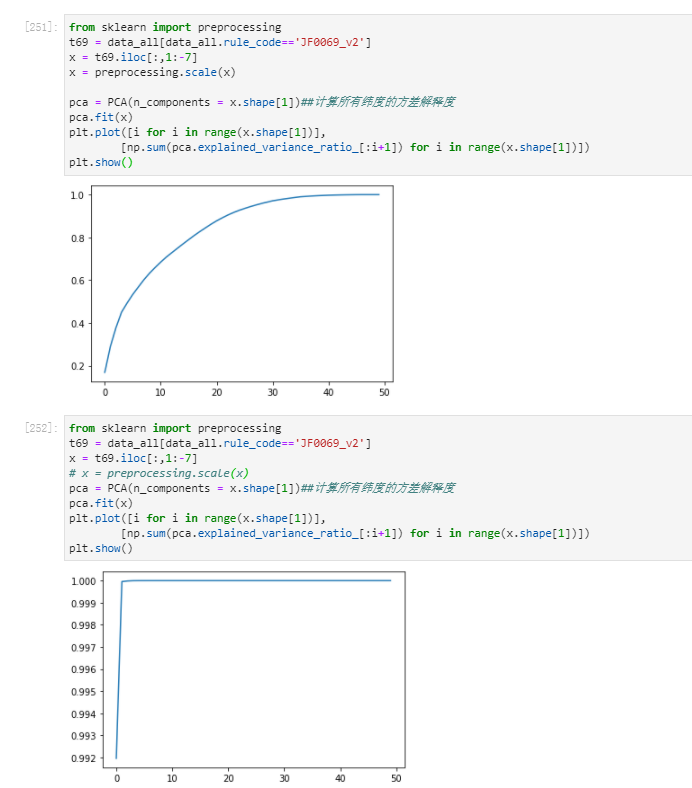

[高维子空间的多种异常挖掘的方法]https://blog.csdn.net/fu_jian_ping/article/details/112596900

[降维算法合集](https://zhuanlan.zhihu.com/p/126661239)

[PCA\LDA\LLE\laplacian Eigenmaps](https://cloud.tencent.com/developer/article/1106120)


# PCA/SVD的深入学习与理解
 - 目前似乎只有pca和svd能输出降维后的关键向量？
 - 从sklearn的官网可知，pca存在多个变种，如kpca等，需要进行了解
  
关于kpca：[pca与kpca的区别，其中包含一篇论文](https://qastack.cn/stats/94463/what-are-the-advantages-of-kernel-pca-over-standard-pca)


Q list：

- [x] 如果变量的纲量不一致，对PCA（或者其他的降维算法）会有影响吗？


### 1、PCA及是否需要标准化：需要
如果不做标准化处理的化，结果如下图，会直接失去掉其他信息值；


[需要标准化的原因：](https://www.jianshu.com/p/ae9db78ebb0f)
[需要进行标准化的其他解释：](http://sofasofa.io/forum_main_post.php?postid=1000375)


pca的白化好像是把方差限制到[0,1]?
[pca的白化参数](https://blog.csdn.net/ouyangfushu/article/details/84797210)

[pandas 和 numpy 的归一化的不同点](https://blog.csdn.net/hjxzb/article/details/78610961https://blog.csdn.net/hjxzb/article/details/78610961)

[几种常用的数据预处理方法：StandardScaler、MinMaxScaler、MaxAbsScaler、Normalizer()](https://www.zhihu.com/question/20467170)
[几种常用的数据预处理方法解释2（更详细）](https://towardsdatascience.com/scale-standardize-or-normalize-with-scikit-learn-6ccc7d176a02)
# 未读List：
- [ ] [pca 和 zca白化的区别](https://stats.stackexchange.com/questions/117427/what-is-the-difference-between-zca-whitening-and-pca-whitening)
- [ ] [系统化介绍白化的一篇文章](https://mccormickml.com/2014/06/03/deep-learning-tutorial-pca-and-whitening/)
    ```
    “这是简化优化过程以找到权重的常用技巧。如果输入信号具有相关输入（一些线性相关性），那么 [cost] 函数将倾向于具有“类似河流”的最小值区域，而不是权重空间中的最小值点.至于输入白化 - 类似的事情 - 如果你不这样做 - 误差函数将倾向于具有非对称的最小值“洞穴”，并且由于一些训练算法对所有权重具有相同的更新速度 - 最小化可能倾向于跳过“在最小值的狭窄维度中的好地方，同时试图取悦更宽的维度。因此它与深度学习没有直接关系。如果您的优化过程收敛良好 - 您可以跳过此预处理。”

- [ ] [手写白化的实现方法](https://stackoverflow.com/questions/6574782/how-to-whiten-matrix-in-pca)
    ```python
    import numpy as np

    def whiten(X,fudge=1E-18):

    # the matrix X should be observations-by-components

    # get the covariance matrix
    Xcov = np.dot(X.T,X)

    # eigenvalue decomposition of the covariance matrix
    d, V = np.linalg.eigh(Xcov)

    # a fudge factor can be used so that eigenvectors associated with
    # small eigenvalues do not get overamplified.
    D = np.diag(1. / np.sqrt(d+fudge))

    # whitening matrix
    W = np.dot(np.dot(V, D), V.T)

    # multiply by the whitening matrix
    X_white = np.dot(X, W)

    return X_white, W
    ```